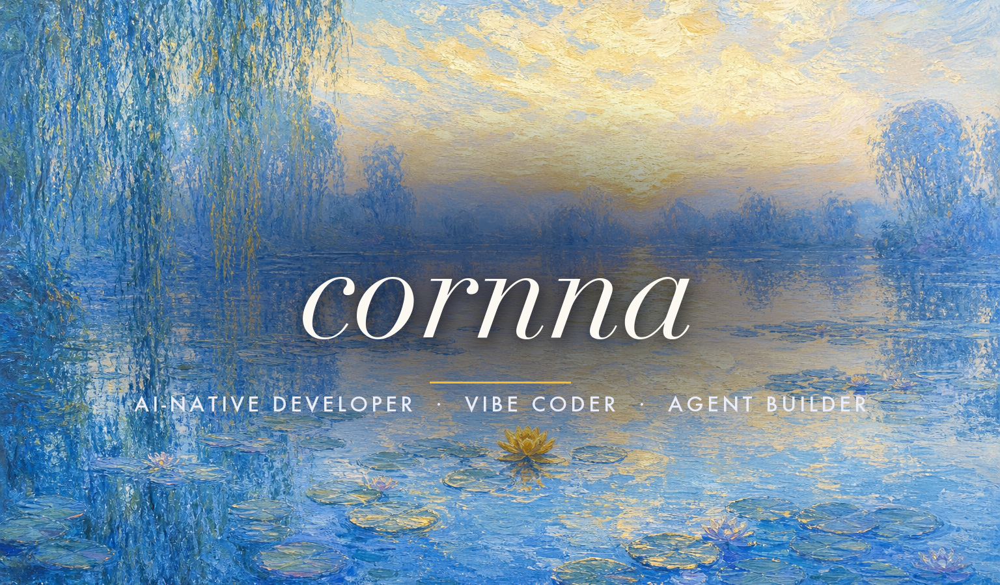
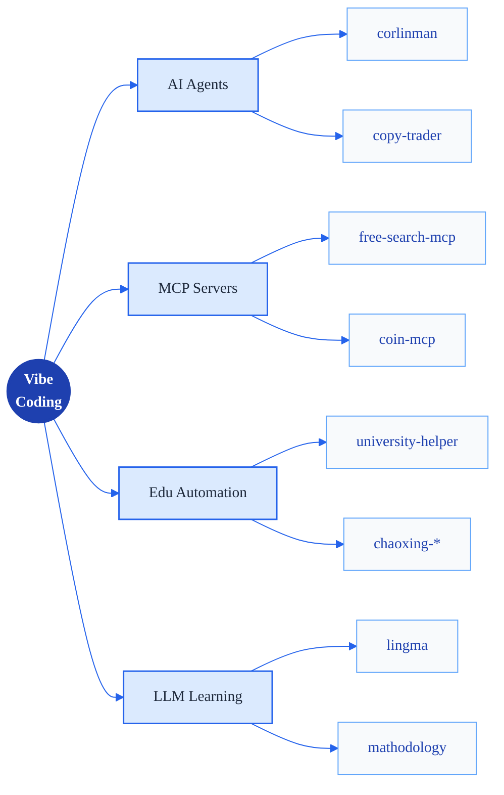
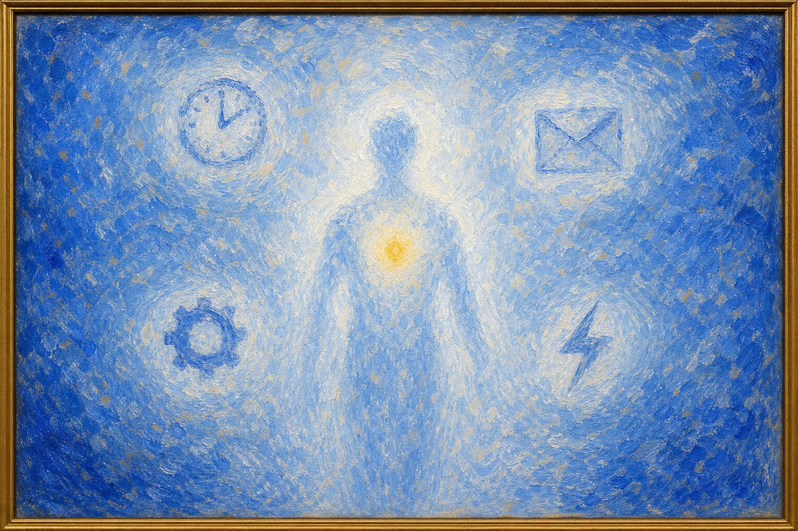
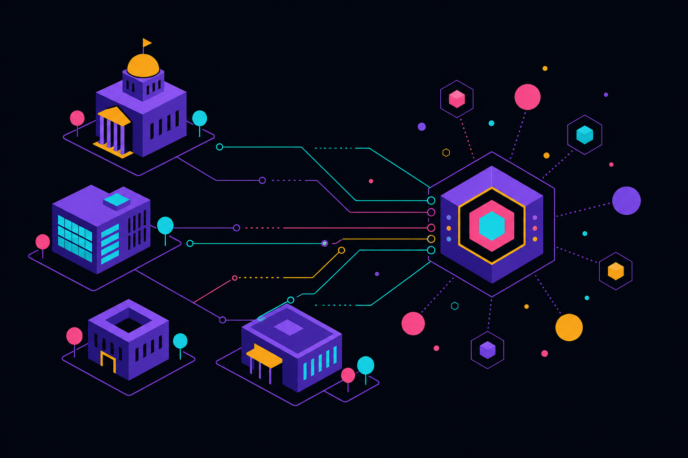
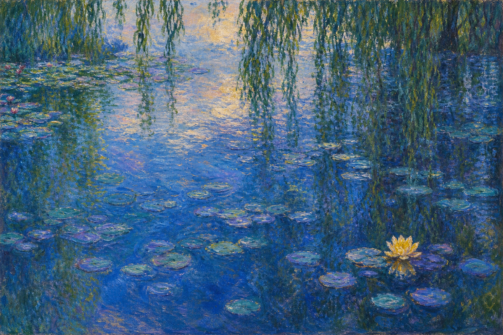
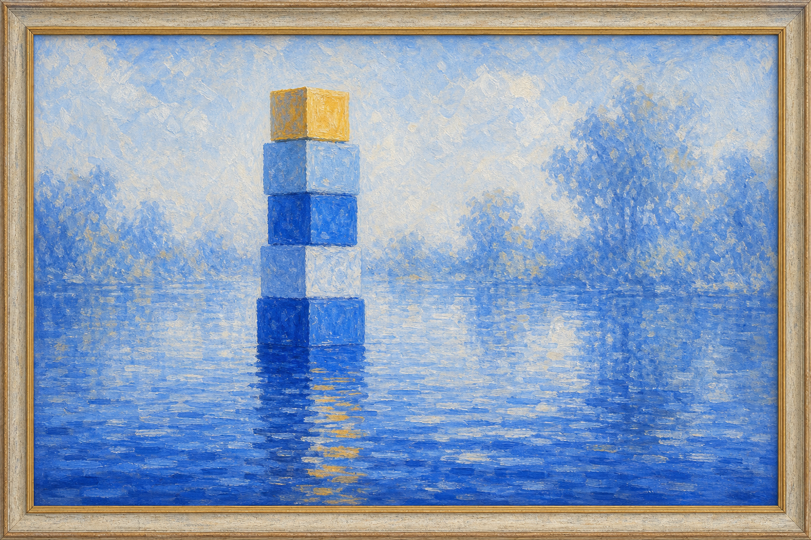
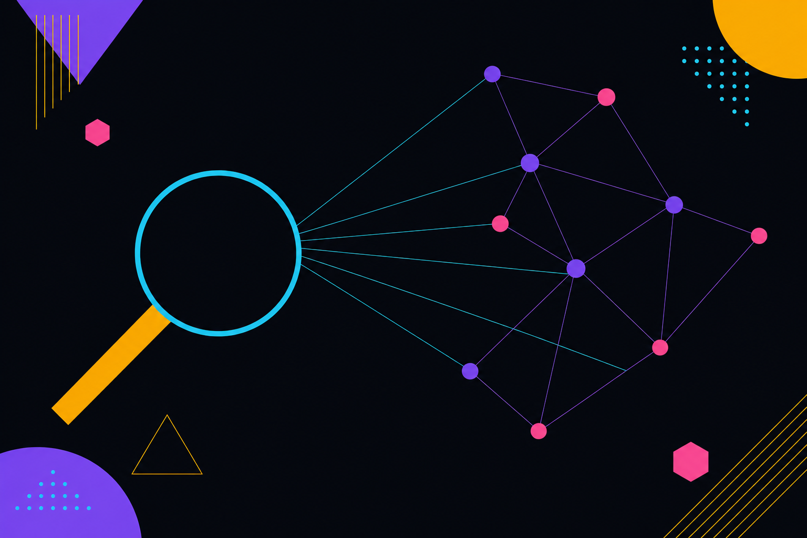

<!-- ┌──────────────────────────────────────────────────────────────────────┐ -->
<!-- │   cornna · profile readme  (English — default)                       │ -->
<!-- │   Concept: a curated exhibition. Custom-painted hero, serif placard  │ -->
<!-- │   typography, framed gallery of works. Impressionist water-lily.     │ -->
<!-- │   canvas #F8FAFC · cobalt #1E40AF · cerulean #2563EB                 │ -->
<!-- │   sky #60A5FA · pale #DBEAFE · ochre #FBBF24                         │ -->
<!-- └──────────────────────────────────────────────────────────────────────┘ -->

<div align="center">

<!-- ░░ HERO — custom painted masthead, title baked into the artwork (true background version) ░░ -->


</div>

<p align="center">
  
  <a href="README.zh-CN.md"></a>
</p>

<br/>

> "I'm not writing code — I collaborate with AI to land the *vibe* in my head as software."
> Like ripples spreading across water: a thought drops into the pond, and AI helps me push it to the shore.
>
> *Don't write code. Direct it.*

<br/>

<div align="center">
  
</div>

## ▍ 01 — Identity

```yaml
name:        cornna
handle:      sweetcornna  ·  github.com/sweetcornna
title:       AI-Native Developer / Vibe Coder
languages:   [Python, TypeScript, C, Go, Shell]
domains:
  - Educational automation     # chaoxing / zhihuishu toolkit
  - AI agents & assistants     # corlinman
  - MCP ecosystem              # free-search-mcp, coin-mcp
  - Network & infrastructure   # OpenWrt plugins, clash, drcom
strengths:
  - Turn a vague idea into a working prototype in one evening.
  - Wire LLMs to anything via MCP / function calls / RAG.
  - Build full-stack tools end-to-end (FE + BE + agent loop).
  - Read & fix real bugs in 170k–370k★ agent codebases (openclaw merged · Hermes in review).
mantra:      "Ship the vibe, polish the rough edges later."
```

<br/>

<div align="center">
  
</div>

## ▍ 02 — Arsenal

<div align="center">

[](https://skillicons.dev)

[](https://skillicons.dev)

[](https://skillicons.dev)

[](https://skillicons.dev)

</div>

<br/>



<br/>

<div align="center">
  
</div>

## ▍ 03 — Signature Work

<sub>A curated room. One flagship, four companions — each an oil study of what it does.</sub>

<br/>

<!-- ╔══ FLAGSHIP — corlinman, C-position ══╗ -->

<a href="https://github.com/sweetcornna/corlinman">
  
</a>

<table>
<tr>
<td valign="middle">

### `01` &nbsp; corlinman&nbsp;·&nbsp;Personal AI Agent

> My own **24×7 digital alter-ego** — schedule, reminders, long-horizon tasks, cross-platform orchestration, all handed off to it. **Vibe-coded from scratch**, turning "I wish I had an assistant" into a long stream of git pushes. My personal bet on what an AI agent should be.

<sub>*Personal AI agent — Python · LLM · Agent Loop · Tools — 2026*</sub>

<a href="https://github.com/sweetcornna/corlinman">
  
</a>

</td>
</tr>
</table>

<br/>

<!-- ╔══ COMPANIONS — 2×2 gallery ══╗ -->

<table>
<tr>

<td width="50%" valign="top">

<a href="https://github.com/sweetcornna/university-helper">
  
</a>

#### `02` &nbsp; university-helper&nbsp;·&nbsp;Campus Automation Hub

One-stop integration of **Zhihuishu · Chaoxing · check-in**, **one-click Docker deploy** — tasks keep running server-side after you close the tab.

<sub>*Campus automation hub — Python · FastAPI · Docker — 2026*</sub>

<a href="https://github.com/sweetcornna/university-helper">Enter the repo →</a>

</td>

<td width="50%" valign="top">

<a href="https://github.com/sweetcornna/mathodology">
  
</a>

#### `03` &nbsp; mathodology&nbsp;·&nbsp;MCM Collaboration Platform

An **AI-augmented** platform for math-modeling contests. Paper · code · data · visualization — all in one workflow.

<sub>*MCM collaboration platform — Python · LLM · RAG — 2026*</sub>

<a href="https://github.com/sweetcornna/mathodology">Enter the repo →</a>

</td>

</tr>
<tr>

<td width="50%" valign="top">

<a href="https://github.com/sweetcornna/lingma">
  
</a>

#### `04` &nbsp; lingma&nbsp;·&nbsp;Visual Coding Classroom

**AI-generated exercises × visual programming** so beginners actually keep going. The LLM writes step-by-step drills; drag the blocks and run.

<sub>*Visual coding classroom — TypeScript · Vue · LLM — 2026*</sub>

<a href="https://github.com/sweetcornna/lingma">Enter the repo →</a>

</td>

<td width="50%" valign="top">

<a href="https://github.com/sweetcornna/free-search-mcp">
  
</a>

#### `05` &nbsp; free-search-mcp&nbsp;·&nbsp;Keyless Search MCP

Gives any LLM agent internet access — multi-engine + Playwright fallback + FTS5 cache, **no API key required**.

<sub>*Keyless search MCP — Python · MCP · Playwright — 2026*</sub>

<a href="https://github.com/sweetcornna/free-search-mcp">Enter the repo →</a>

</td>

</tr>
</table>

<br/>

<div align="center">
  <a href="https://github.com/sweetcornna?tab=repositories">
    
  </a>
</div>

<br/>

<div align="center">
  
</div>

## ▍ 04 — Open Source

<sub>Brushstrokes left on the giants — real bugs fixed in 170k–370k★ agent codebases. Every PR is a public, reviewable record.</sub>

<br/>

<table>
<tr>

<td width="50%" valign="top">

#### openclaw&nbsp;·&nbsp;

Open-source personal AI agent runtime. **Merged PR [#87698](https://github.com/openclaw/openclaw/pull/87698)** — `fix(gateway): emit subagent_ended hook` (fixes issue #59164), landing in the runtime core; more PRs in review. Same lineage as my own corlinman: local-first · files-as-skills/memory · multi-channel.

<sub>*Merged a fix into the runtime core — more PRs in review.*</sub>

<a href="https://github.com/openclaw/openclaw/pull/87698">
  
</a>

</td>

<td width="50%" valign="top">

#### Hermes Agent&nbsp;·&nbsp;

Nous Research's open-source agent framework. Submitted **multiple fix PRs (in review)** across concurrency / streaming / retry paths — `anthropic` stale-stream retry, `cron` exception recovery, Telegram state persistence; plus original **persona + event** extensions in my own repo [personal_hermes](https://github.com/sweetcornna/personal_hermes).

<sub>*Multiple fix PRs in review across concurrency / streaming / retry paths.*</sub>

<a href="https://github.com/NousResearch/hermes-agent">
  
</a>

</td>

</tr>
</table>

<br/>

<div align="center">
  
</div>

## ▍ 05 — Telemetry

<div align="center">

&nbsp;
&nbsp;
&nbsp;


<br/><br/>


<br/><br/>


<br/><br/>


<br/><br/>

<sub>ACHIEVEMENTS</sub><br/>
&nbsp;
&nbsp;
&nbsp;


</div>

<br/>

<div align="center">
  
</div>

## ▍ 06 — Reach

<div align="center">

<a href="https://github.com/sweetcornna">
  
</a>
<a href="mailto:ymy_live@outlook.com">
  
</a>
<a href="https://github.com/sweetcornna?tab=repositories">
  
</a>

<br/><br/>

<sub>Open to collaborate on AI agents · MCP servers · education automation · on-chain tooling. Email me directly.</sub>

</div>

<br/>

<div align="center">
  
  <sub><i>Made with vibe — directed, not written.</i></sub>
</div>
