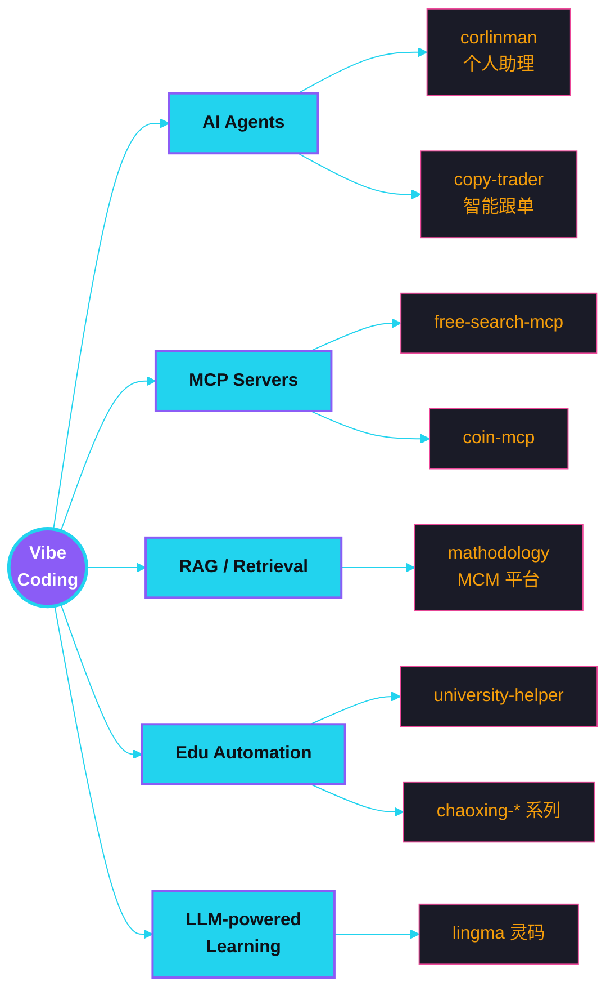

<!-- ╔══════════════════════════════════════════════════════════════════════╗ -->
<!-- ║                        ymylive · profile readme                       ║ -->
<!-- ║         AI-Native Developer · Vibe Coder · Agent Builder              ║ -->
<!-- ╚══════════════════════════════════════════════════════════════════════╝ -->

<div align="center">

<a href="https://github.com/ymylive">
  
</a>

<br/>

<a href="https://github.com/ymylive">
  
</a>

<br/><br/>

<a href="https://github.com/ymylive">
  
</a>


<br/>


</div>

> ### 「我相信下一个十年，写代码的方式会被重新定义。」
> 我不是在编程，而是在和 AI 协作把脑子里的"vibe"落地成软件。
> Education automation、Agent、MCP、链上工具、个人助理——能用 LLM 撬动的事，都值得做一次。
>
> *— Don't write code. Direct it.*

---

## ▍ 01 — Identity · 身份

```yaml
name:          ymylive
title:         AI-Native Developer / Vibe Coder
specialty:     [LLM apps, AI agents, MCP servers, automation]
languages:     [Python, TypeScript, C, Go, Shell]
domains:
  - 🎓 Educational automation   # chaoxing / zhihuishu 全家桶
  - 🤖 AI agents & assistants    # personal agents, copy-trader, corlinman
  - 🔌 MCP ecosystem             # free-search-mcp, coin-mcp, valuescan-mcp
  - 🌐 Network & infrastructure  # OpenWrt plugins, clash, drcom
strengths:
  - Turn a vague idea into a working prototype in one evening.
  - Wire LLMs to anything via MCP / function calls / RAG.
  - Build full-stack tools (FE + BE + agent loop) end-to-end.
mantra:        "Ship the vibe, polish the rough edges later."
```

---

## ▍ 02 — Arsenal · 技术栈

<div align="center">

**Languages**

[](https://skillicons.dev)

**AI · Agent · Data**

[](https://skillicons.dev)

**Backend & Frontend**

[](https://skillicons.dev)

**Infra & Tools**

[](https://skillicons.dev)

</div>

### AI capability map · 能力图谱



---

## ▍ 03 — Signature Work · 精选作品

<table>
<tr>
<td width="50%" valign="top">
<a href="https://github.com/ymylive/university-helper">
  
</a>
</td>
<td width="50%" valign="middle">

### `01` university-helper · 校园自动化中枢

一站式打通 **智慧树 · 学习通 · 签到** 的全自动学习平台。
**Docker 一键部署**，关掉网页后端照跑，老师再也催不到课。

`Python` `FastAPI` `Docker` `Async`

[**→ Open repo**](https://github.com/ymylive/university-helper)

</td>
</tr>

<tr>
<td width="50%" valign="middle">

### `02` corlinman · 个人 AI 智能体

我自己的 24×7 数字分身——日程、提醒、自动化任务全交给它。
**Vibe-coded** from scratch，把"如果有个助理就好了"变成了 git push。

`Python` `LLM` `Agent` `Tools`

[**→ Open repo**](https://github.com/ymylive/corlinman)

</td>
<td width="50%" valign="top">
<a href="https://github.com/ymylive/corlinman">
  
</a>
</td>
</tr>

<tr>
<td width="50%" valign="top">
<a href="https://github.com/ymylive/mathodology">
  
</a>
</td>
<td width="50%" valign="middle">

### `03` mathodology · 美赛 MCM 协作平台

为数学建模竞赛打造的 **AI-augmented** 协作平台。
论文、代码、数据、可视化——一个工作流跑完整场比赛。

`Python` `LLM` `RAG` `Collab`

[**→ Open repo**](https://github.com/ymylive/mathodology)

</td>
</tr>

<tr>
<td width="50%" valign="middle">

### `04` lingma 灵码 · 可视化编程学习

把 **AI 出题 × 可视化编程** 拼到了一起，让初学者真的"学得动"。
LLM 实时生成阶梯式练习，前端拖拽即得运行结果。

`TypeScript` `Vue` `LLM` `EdTech`

[**→ Open repo**](https://github.com/ymylive/lingma)

</td>
<td width="50%" valign="top">
<a href="https://github.com/ymylive/lingma">
  
</a>
</td>
</tr>

<tr>
<td width="50%" valign="top">
<a href="https://github.com/ymylive/free-search-mcp">
  
</a>
</td>
<td width="50%" valign="middle">

### `05` free-search-mcp · 零密钥搜索 MCP

**Local-first** MCP 服务器，让任何 LLM Agent 拥有联网能力——
多引擎（DuckDuckGo / Mojeek / Startpage）+ Playwright 回退 + FTS5 缓存，
**无需任何 API Key**。Agent 工作流的标配补丁。

`Python` `MCP` `Playwright` `SQLite-FTS5`

[**→ Open repo**](https://github.com/ymylive/free-search-mcp)

</td>
</tr>
</table>

<div align="center">
  <a href="https://github.com/ymylive?tab=repositories">
    
  </a>
</div>

---

## ▍ 04 — Telemetry · 数据画像

<div align="center">

<a href="https://github.com/ymylive">
  
</a>
<a href="https://git.io/streak-stats">
  
</a>

<a href="https://github.com/ymylive">
  
</a>
<a href="https://github.com/ymylive">
  
</a>

<br/>


</div>

### Trophy wall · 成就墙

<div align="center">
  <a href="https://github.com/ryo-ma/github-profile-trophy">
    
  </a>
</div>

### Snake parade · 贪吃蛇贡献图

<div align="center">
  
</div>

---

## ▍ 05 — Reach · 联系

<div align="center">

<a href="https://github.com/ymylive">
  
</a>
<a href="mailto:denis_dolorumgul@mail.com">
  
</a>
<a href="https://github.com/ymylive?tab=repositories">
  
</a>
<a href="https://github.com/ymylive?tab=stars">
  
</a>

<br/><br/>

<sub>📨 想合作 AI agent / MCP / 教育自动化 / 链上工具，邮件直接拍过来。<br/>
Open to collab on AI agents, MCP servers, education automation, on-chain tooling.</sub>

</div>

---

<div align="center">


<br/>


<sub><i>Made with vibe — and a lot of caffeine. ☕</i></sub>
<br/>
<sub>⭐ Star a repo if it helped · 觉得有用就点个 Star</sub>

</div>
