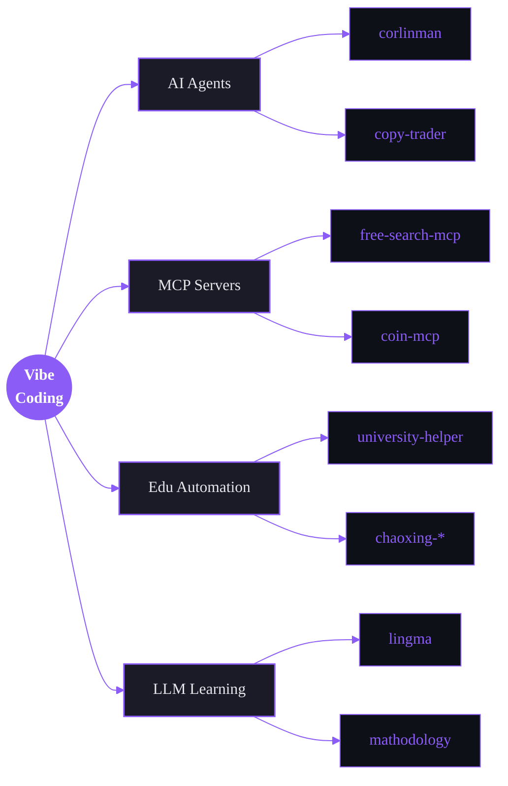

<!-- ┌──────────────────────────────────────────────────────────────────────┐ -->
<!-- │   ymylive · profile readme                                           │ -->
<!-- │   AI-Native Developer · Vibe Coder · Agent Builder                   │ -->
<!-- │   Editorial layout — single hero, 4-color discipline, no horizontal  │ -->
<!-- │   rules. Major sections use full-width SVG masthead bars.            │ -->
<!-- └──────────────────────────────────────────────────────────────────────┘ -->

<div align="center">


<br/>


<br/><br/>

&nbsp;
&nbsp;
&nbsp;


</div>

<br/>

> ### 「我不是在编程，我在和 AI 协作，把脑子里的 *vibe* 落地成软件。」
>
> Education automation · AI agents · MCP servers · on-chain tools — 能用 LLM 撬动的事，都值得做一次。
>
> *— Don't write code. Direct it.*

<br/>

## ▍ 01 — Identity

```yaml
name:        ymylive
title:       AI-Native Developer / Vibe Coder
specialty:   [LLM apps, AI agents, MCP servers, automation]
languages:   [Python, TypeScript, C, Go, Shell]
domains:
  - Educational automation     # chaoxing / zhihuishu 全家桶
  - AI agents & assistants     # personal agents, copy-trader, corlinman
  - MCP ecosystem              # free-search-mcp, coin-mcp, valuescan-mcp
  - Network & infrastructure   # OpenWrt plugins, clash, drcom
strengths:
  - Turn a vague idea into a working prototype in one evening.
  - Wire LLMs to anything via MCP / function calls / RAG.
  - Build full-stack tools end-to-end (FE + BE + agent loop).
mantra:      "Ship the vibe, polish the rough edges later."
```

<br/>

## ▍ 02 — Arsenal

<div align="center">

[](https://skillicons.dev)

[](https://skillicons.dev)

[](https://skillicons.dev)

[](https://skillicons.dev)

</div>

<br/>



<br/>

<div align="center">
  
</div>

<br/>

<div align="center">
  
</div>

<br/>

<!-- ╔══ HERO PROJECT — full-width flagship ══╗ -->

<a href="https://github.com/ymylive/university-helper">
  
</a>

<table>
<tr>
<td valign="middle">

### `01` &nbsp; university-helper&nbsp;·&nbsp;校园自动化中枢

> 一站式打通 **智慧树 · 学习通 · 签到** 的全自动学习平台。**Docker 一键部署**，关掉网页后端照跑——把"学习"这件事从你日历里彻底删掉。

`Python` &nbsp;·&nbsp; `FastAPI` &nbsp;·&nbsp; `Docker` &nbsp;·&nbsp; `Async`

<a href="https://github.com/ymylive/university-helper">
  
</a>

</td>
</tr>
</table>

<br/>

<!-- ╔══ Other 4 projects — tight 2×2 grid ══╗ -->

<table>
<tr>

<td width="50%" valign="top">

<a href="https://github.com/ymylive/corlinman">
  
</a>

#### `02` &nbsp; corlinman&nbsp;·&nbsp;个人 AI 智能体

24×7 数字分身——日程、提醒、自动化任务全交给它。**Vibe-coded from scratch**。

<sub>`Python` · `LLM` · `Agent` · `Tools`</sub>

<a href="https://github.com/ymylive/corlinman">Open repo →</a>

</td>

<td width="50%" valign="top">

<a href="https://github.com/ymylive/mathodology">
  
</a>

#### `03` &nbsp; mathodology&nbsp;·&nbsp;美赛 MCM 协作平台

为数学建模竞赛打造的 **AI-augmented** 协作平台。论文 · 代码 · 数据 · 可视化一个工作流跑完。

<sub>`Python` · `LLM` · `RAG` · `Collab`</sub>

<a href="https://github.com/ymylive/mathodology">Open repo →</a>

</td>

</tr>
<tr>

<td width="50%" valign="top">

<a href="https://github.com/ymylive/lingma">
  
</a>

#### `04` &nbsp; lingma 灵码&nbsp;·&nbsp;可视化编程学习

**AI 出题 × 可视化编程**，让初学者真的学得动。LLM 生成阶梯练习，拖拽即跑。

<sub>`TypeScript` · `Vue` · `LLM` · `EdTech`</sub>

<a href="https://github.com/ymylive/lingma">Open repo →</a>

</td>

<td width="50%" valign="top">

<a href="https://github.com/ymylive/free-search-mcp">
  
</a>

#### `05` &nbsp; free-search-mcp&nbsp;·&nbsp;零密钥搜索 MCP

让任何 LLM Agent 拥有联网能力——多引擎 + Playwright 回退 + FTS5 缓存，**无需 API Key**。

<sub>`Python` · `MCP` · `Playwright` · `SQLite`</sub>

<a href="https://github.com/ymylive/free-search-mcp">Open repo →</a>

</td>

</tr>
</table>

<br/>

<div align="center">
  <a href="https://github.com/ymylive?tab=repositories">
    
  </a>
</div>

<br/>

<div align="center">
  
</div>

<br/>

<div align="center">
  
</div>

<br/>

<div align="center">

<!-- name card: stats full-width -->


<br/><br/>

<!-- 1×2 supporting cards -->


<br/><br/>

<!-- activity pulse: full-width -->


<br/><br/>

<!-- snake: full-width -->


<br/><br/>

<!-- trophies: muted gold accent, compact single row -->


</div>

<br/>

## ▍ 05 — Reach

<div align="center">

<a href="https://github.com/ymylive">
  
</a>
<a href="mailto:denis_dolorumgul@mail.com">
  
</a>
<a href="https://github.com/ymylive?tab=repositories">
  
</a>

<br/><br/>

<sub>想合作 AI agent · MCP · 教育自动化 · 链上工具，邮件直接拍过来。</sub>

</div>

<br/>

<div align="center">
  
  <sub><i>Made with vibe — directed, not written.</i></sub>
</div>
